

# 🌪️ Portfolio CFD & Aérodynamique — Nicolas Cabaset

**Élève-ingénieur ESTACA · Simulation numérique des écoulements · Aérodynamique automobile & sport auto**

 

&nbsp;&nbsp;&nbsp;&nbsp;
&nbsp;&nbsp;&nbsp;&nbsp;
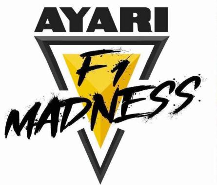

  

 

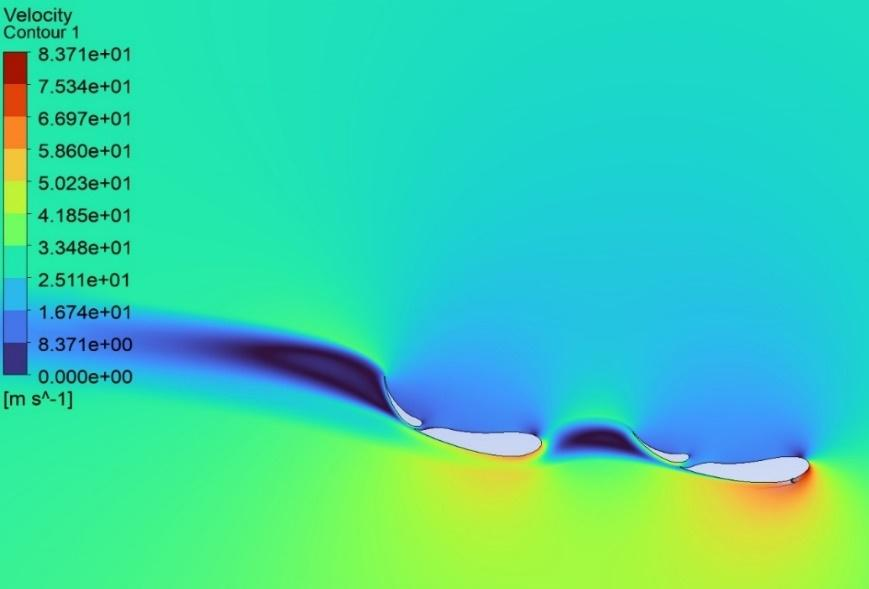

<i>Contour de vitesse de la meilleure configuration du double aileron arrière de la Ligier JS21 (Cl = 2,57)</i>

---

## 📑 Sommaire

| # | Projet | Cadre | Période | Outils |
|:-:|---|---|---|---|
| 1 | [**Étude CFD sur modèle DrivAer avec HPC**](#1--étude-cfd-sur-modèle-drivaer-avec-hpc) | Linköping University (LiU) — cours *Applied CFD* | 09/2026 → en cours | Fluent Standalone · ANSA · ParaView · HPC · Python |
| 2 | [**Étude CFD Ligier JS21 pour Monaco**](#2--ayari-racing-x-estaca--étude-cfd-ligier-js21-pour-monaco) | Partenariat Ayari Racing × ESTACA | 10/2025 → 04/2026 | Ansys Workbench · SolidWorks · Python · Excel |
| 3 | [**Amélioration de la soufflerie de HAN**](#3--amélioration-de-la-soufflerie-de-han) | HAN University of Applied Sciences | 02/2025 → 06/2025 | SolidWorks Flow Simulation · SolidWorks · Excel · Cura |

---

## 1 · Étude CFD sur modèle DrivAer avec HPC

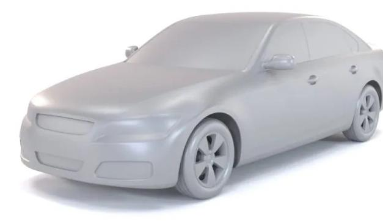

> 🟡 **Projet en cours**

| | |
|---|---|
| **Contexte** | Semestre d'échange à Linköping University — projet du cours *Applied CFD* |
| **Rôle** | Co-responsable CFD et *CAD cleaning* |
| **Outils** | Ansys Fluent Standalone · ANSA · ParaView · HPC (Linux) · Python |

**🎯 Objectif :** partir d'une géométrie « sale » du DrivAer pour aboutir à une simulation CFD sur cluster HPC, puis **automatiser et généraliser** tout le workflow.

 

### 🧹 Nettoyage CAO (ANSA)

- **Correction topologique** — suppression des surfaces sécantes, fermeture étanche de tous les trous.
- **Simplification géométrique** — lissage des zones complexes (calandre), retrait des appendices secondaires (rétroviseurs) pour alléger le calcul.
- **Contact au sol** — création de surfaces de contact sous les pneus pour une transition propre route/roues.

<table>
<tr>
<td align="center">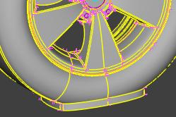 Surface de contact pneu/sol</td>
<td align="center">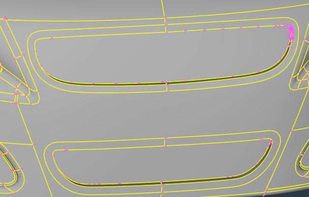 Calandre simplifiée et fermée</td>
</tr>
</table>

### 🔺 Maillage surfacique & préparation volumique

- Maillage carrosserie basé sur la **courbure** avec bornes min/max strictes.
- Raffinement ciblé sur les roues (taille max réduite + *growth rate* imposé).
- Contrôle qualité : correction des cellules de **skewness > 0,95**.
- Trois volumes de raffinement emboîtés (**BOI** – *Bodies Of Influence*) pour guider le maillage du sillage.

<table>
<tr>
<td align="center" width="50%">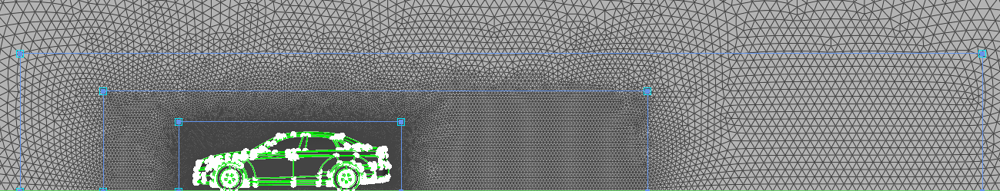 Maillage surfacique et BOI (bleu)</td>
<td align="center" width="50%">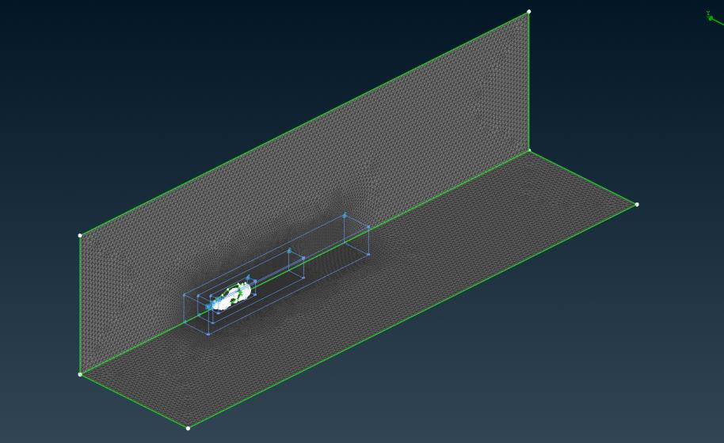 Domaine complet avec maillage et BOI</td>
</tr>
</table>

### 🧊 Maillage volumique *(en cours)*

- **Prism layers** différenciées selon les surfaces physiques.
- **Ciblage y+** via la méthode *last ratio* sur carrosserie et roues.
- **Transition au sol** via la méthode *aspect ratio* pour éviter les sauts de taille de mailles.
- Paramétrage des trois volumes de raffinement.

### ⚙️ Automatisation *(en cours)*

Scripts pour automatiser l'ensemble du workflow (maillage → solveur → post-traitement), pensés pour être réutilisables sur d'autres géométries.

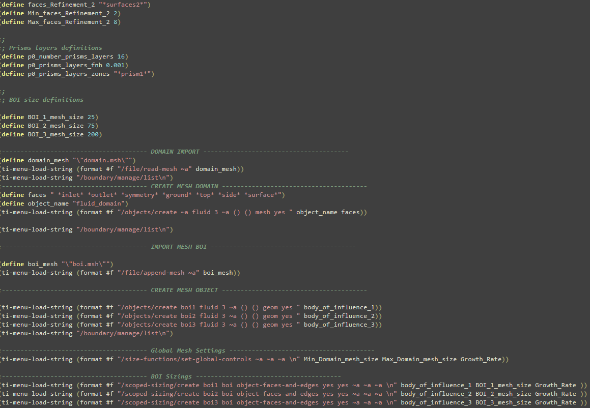 
<i>Ébauche de script « user-friendly » pour automatiser le maillage sous Fluent</i>

### 🗺️ Suite du projet

- [ ] Validation du maillage volumique (critère ICEM CFD, aspect ratio…)
- [ ] Script de maillage généralisé
- [ ] Paramétrage solveur : rotation des roues, sol mobile, conditions aux limites
- [ ] Script solveur généralisé
- [ ] Revue de la simulation et analyse des résidus
- [ ] Post-traitement sous ParaView

---

## 2 · Ayari Racing × ESTACA — Étude CFD Ligier JS21 pour Monaco

<table>
<tr>
<td width="55%">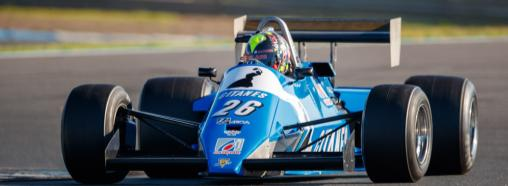</td>
<td>

| | |
|---|---|
| **Contexte** | Partenariat technique d'un an (ESTACA 4A) avec le pilote **Soheil Ayari** pour améliorer l'aéro d'une F1 historique engagée au **Grand Prix de Monaco Historique** |
| **Rôle** | Responsable des études CFD · Référent technique entre le pilote et le groupe projet |
| **Outils** | Ansys Workbench (Fluent / Meshing) · SolidWorks · Python · Excel |

</td>
</tr>
</table>

### A) Optimisation de l'aileron avant

**🎯 Objectif :** trouver l'angle d'attaque optimal de l'aileron avant **en fonction de sa hauteur au sol**.

<b>🔧 Démarche technique</b>

 

**Étude paramétrique** — variation de l'angle d'attaque (plage validée en CAO) et de la hauteur au sol (plage définie avec le pilote).

**Domaine, maillage & conditions aux limites**
- Simulation **2D** de l'aileron isolé pour isoler l'effet de l'incidence.
- Vitesse **30 m/s** (besoin piste/pilote), sol en **paroi mobile**.
- Domaine : 10c amont · 15c aval · 10c en hauteur.
- Maillage quadrangle à 3 zones de densité + couches limites pour **y+ ≈ 1**.

<table>
<tr>
<td align="center" width="33%">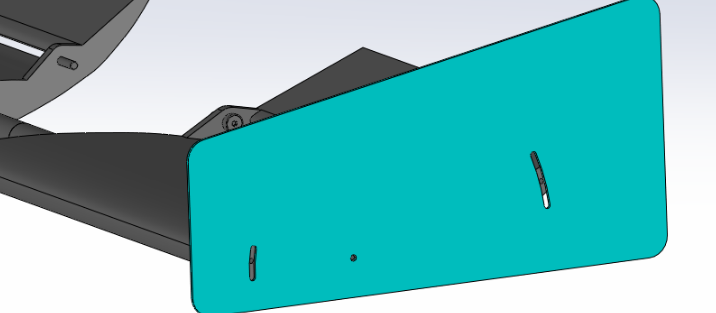 CAO – plage d'angle imposée par le flap</td>
<td align="center" width="33%">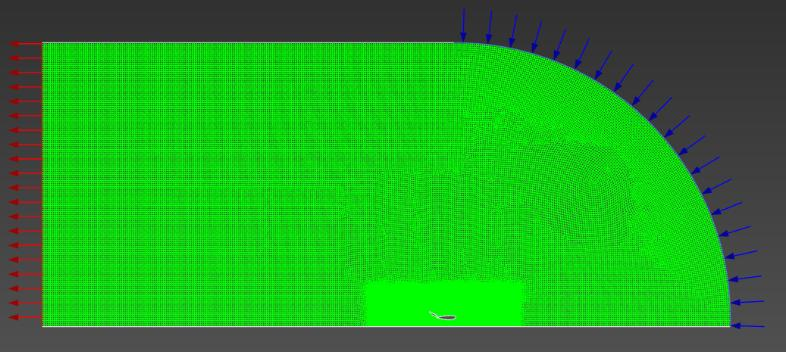 Domaine et conditions aux limites</td>
<td align="center" width="33%">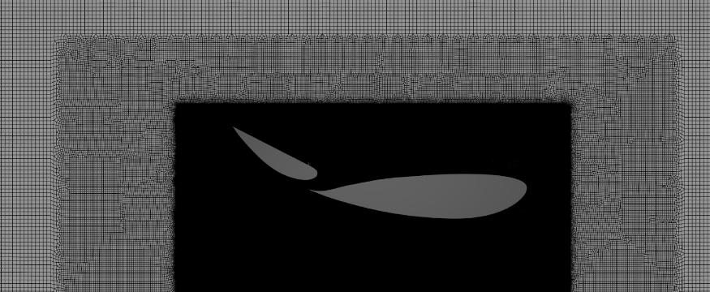 Maillage à 3 zones d'influence</td>
</tr>
</table>

**Vérification stationnaire vs transitoire** (modèle **k-ω SST**, imposé par les limites matérielles)
- En stationnaire : oscillations du Cl et des résidus.
- En transitoire : meilleure convergence (continuité 1e-3 contre 1e-2).
- Les deux aboutissent au **même Cl** → maintien du stationnaire pour tenir la cadence de la campagne.

<table>
<tr><th>Stationnaire</th><th>Transitoire</th></tr>
<tr>
<td align="center">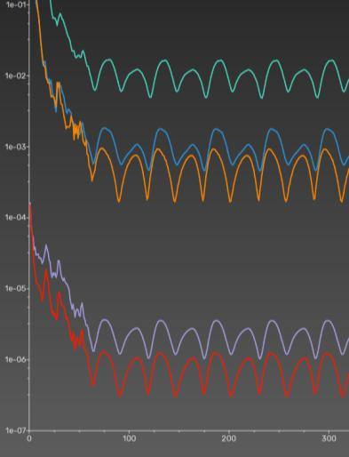 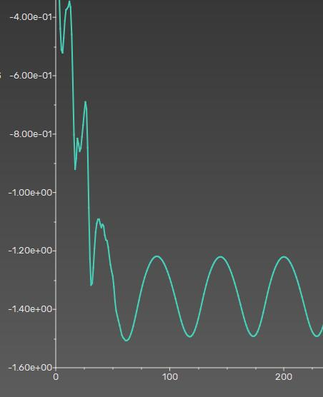</td>
<td align="center">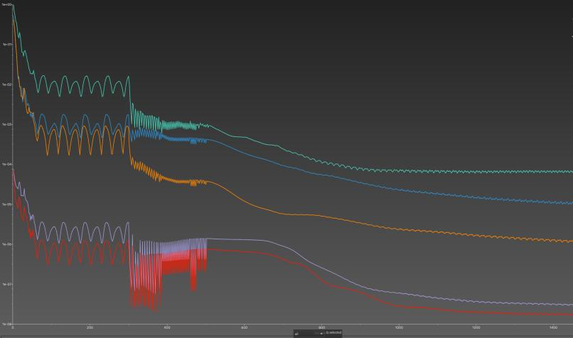 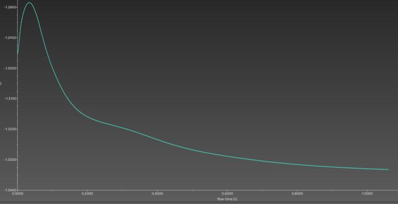</td>
</tr>
</table>

**Post-traitement**
- Métrique unique : **Cl** (appui), utilisée à titre comparatif (2D).
- **Script Python** de traitement du signal : exclusion du transitoire, moyenne sur cycles stabilisés par **autocorrélation**, extraction automatique après le batch.
- Traduction des résultats en **réglages mesurables au mètre ruban** pour le pilote.

#### 📈 Résultats — campagne de 90 simulations

<table>
<tr>
<td align="center" width="50%">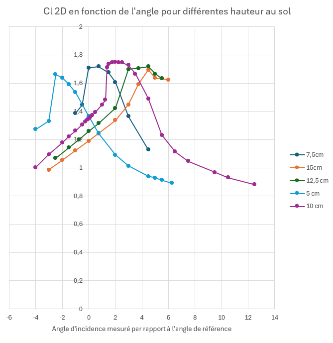 Cl en fonction de l'angle d'attaque pour différentes hauteurs au sol</td>
<td align="center" width="50%">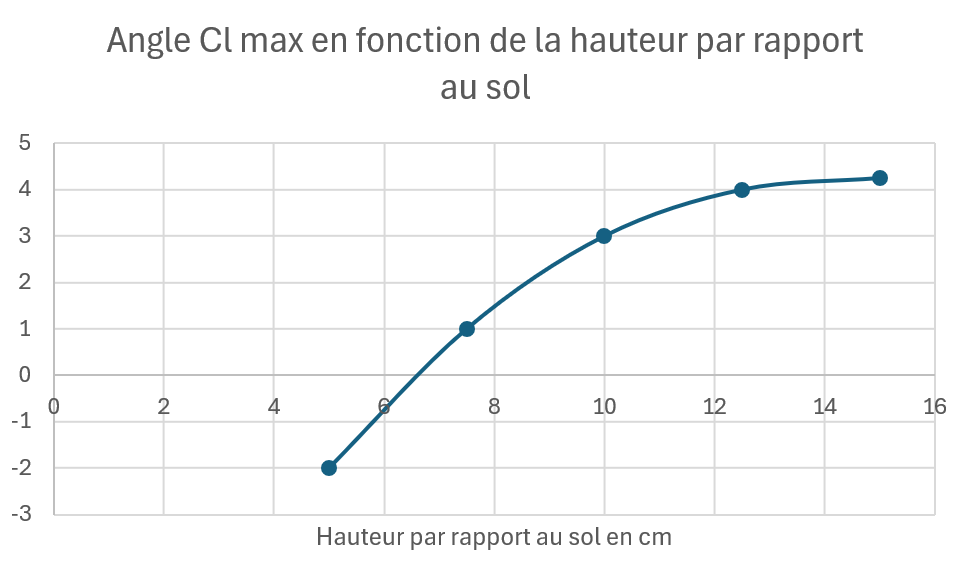 Angle de Cl max en fonction de la hauteur — l'abaque utilisé par le pilote le jour J</td>
</tr>
</table>

**Livrables :** courbes de réglage + rapport technique vulgarisé à destination du pilote.

### B) Optimisation de l'aileron arrière (configuration Monaco)

**🎯 Objectif :** optimiser la géométrie du double aileron arrière spécifique au GP de Monaco.

<table>
<tr>
<td align="center" width="50%">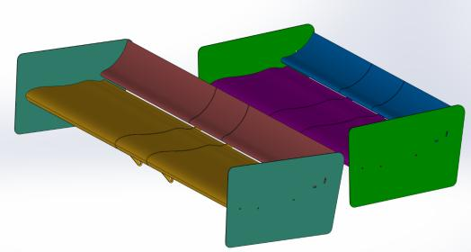 CAO du double aileron arrière (Ligier JS21, 1983)</td>
<td align="center" width="50%">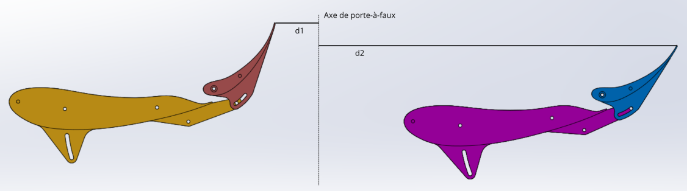 Distances réglementaires d1 / d2</td>
</tr>
</table>

**Étude paramétrique** — arbitrage entre réglementation technique et débattements permis par la CAO :

| Paramètre | Plage admissible |
|---|---|
| d1 | > 0 |
| d2 | [0 ; 600 mm] |
| Hauteur aile / sol | 1000 mm max |
| Angle du flap | [0 ; 20°] |
| Angle d'attaque (α) | libre |

<table>
<tr>
<td align="center">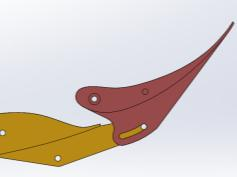 Angle flap maxi</td>
<td align="center">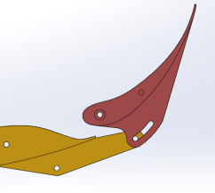 Angle flap mini</td>
<td align="center">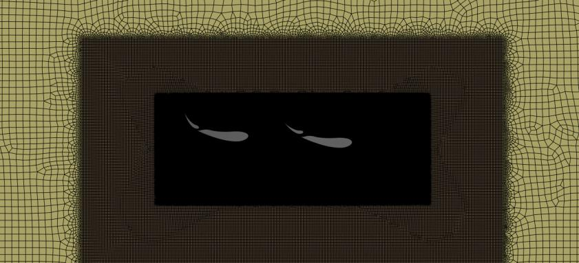 Maillage à 3 zones d'influence</td>
<td align="center">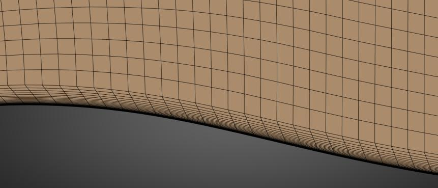 Couches d'inflation (y+ ≈ 1)</td>
</tr>
</table>

Reprise de l'environnement 2D standardisé de l'aileron avant (maillage, y+, k-ω SST stationnaire) et réutilisation du script Python pour dépouiller **40 configurations**.

#### 🏁 Résultat : Cl multiplié par ~2,6

<table>
<tr>
<td align="center" width="50%">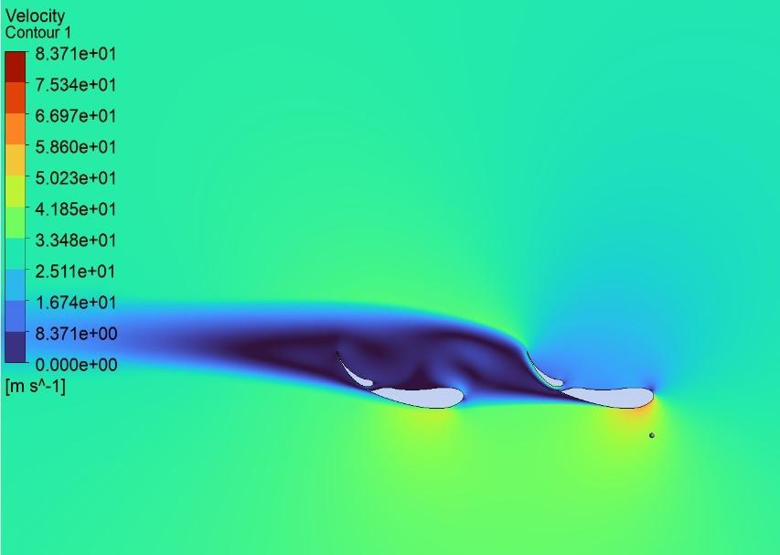 <b>Configuration de base — Cl = 0,97</b></td>
<td align="center" width="50%"> <b>Meilleure configuration — Cl = 2,57</b></td>
</tr>
</table>

> La configuration optimale exploite pleinement les deux ailerons, là où la configuration de base laisse une large zone décollée.

---

## 3 · Amélioration de la soufflerie de HAN

<table>
<tr>
<td width="55%">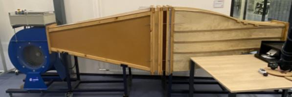</td>
<td>

| | |
|---|---|
| **Contexte** | Semestre d'échange à HAN University of Applied Sciences (Pays-Bas) — projet d'ingénierie à quasi plein temps (4 j/semaine) |
| **Rôle** | Responsable simulations CFD |
| **Outils** | SolidWorks Flow Simulation · SolidWorks CAO · Excel · Cura |

</td>
</tr>
</table>

### A) Faisabilité de l'intégration CFD complète du ventilateur

**🎯 Objectif :** évaluer si un couplage CFD complet ventilateur + soufflerie est réaliste pour identifier les axes d'amélioration.

- **Mesures réelles au tube de Pitot** sur une grille de points identique à celle de la CFD, en sortie de ventilateur.
- **Mise au point du modèle** : raffinements itératifs (y+, interface rotor/stator, zones de fort gradient), rugosité de paroi, modèle de rotation adapté.
- **Troubleshooting des crashs solveur** : réduction progressive de la vitesse de rotation, diagnostic et simplification de micro-détails géométriques bloquants.

<table>
<tr>
<td align="center" width="33%">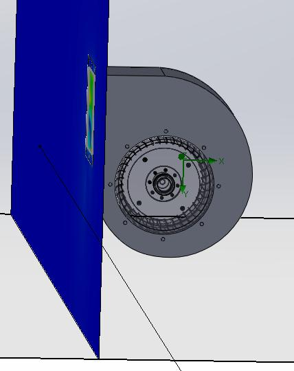 Modèle CAO du ventilateur</td>
<td align="center" width="33%">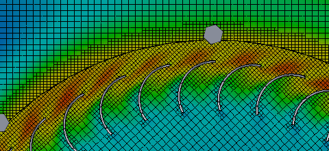 Raffinement autour des zones de fort gradient et de l'interface rotor/stator</td>
<td align="center" width="33%">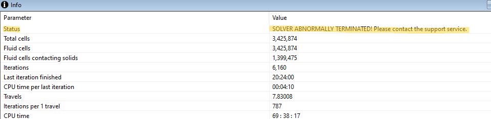 Crash solveur après 3 jours de calcul</td>
</tr>
</table>

<table>
<tr>
<td align="center" width="50%">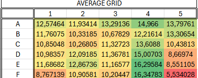 Vitesses moyennes mesurées (m/s)</td>
<td align="center" width="50%">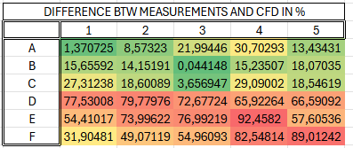 Écart CFD / mesures (%)</td>
</tr>
</table>

**Conclusion :** écarts majeurs mis en évidence et démonstration qu'un modèle corrélé au réel n'est pas atteignable avec un PC grand public et les délais impartis. Le bilan méthodologique a servi de **retour d'expérience pour recadrer le cours de CFD** de l'université.

### B) Conception d'un profil aérodynamique pour l'injection de fumée (*smoke rake*)

**🎯 Objectif :** concevoir un carénage profilé pour le peigne à fumée afin de réduire sa traînée parasite et d'injecter un filet de fumée non perturbé.

1. **Présélection** de 4 profils laminaires **NACA série 6 symétriques** à faible traînée, mis à l'échelle sous SolidWorks pour loger le peigne.
2. **Caractérisation CFD du sillage** à V∞ = 22,2 m/s sur une grille de mesure aval → choix du profil **10 % d'épaisseur**, dont les vitesses restent les plus proches de l'écoulement libre.
3. **Étude paramétrique des buses** (en retrait, affleurantes, sortantes) pour garantir la meilleure régularité de flux.
4. **Conception interne évidée et impression 3D** (Cura) avec anticipation des jeux de montage.

<table>
<tr>
<td align="center" width="50%">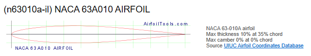 Profil NACA 63A010 retenu</td>
<td align="center" width="50%">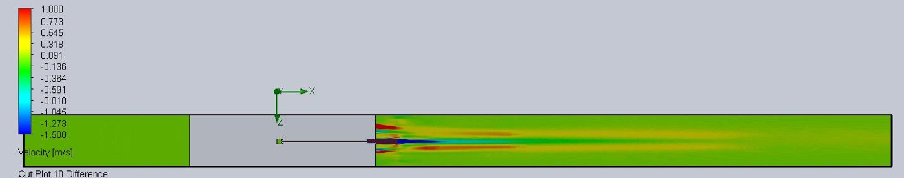 Cut plot comparatif des configurations de buses</td>
</tr>
<tr>
<td align="center">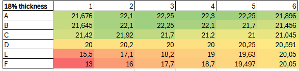 Vitesses en sillage – profil 18 %</td>
<td align="center">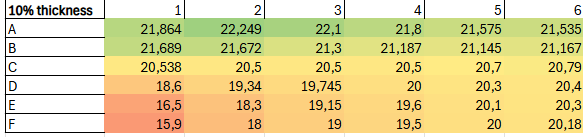 Vitesses en sillage – profil 10 % ✅</td>
</tr>
</table>

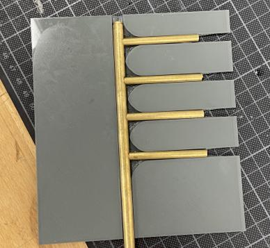 &nbsp;
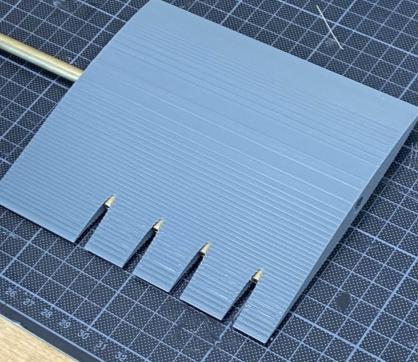 
<i>Pièce imprimée en 3D ajustée sur le peigne, prête pour le lissage de surface avant essais en soufflerie</i>

---

## 🧠 Compétences développées

<table>
<tr>
<td width="50%" valign="top">

**Simulation & méthodes numériques**
- Préparation et nettoyage CAO (ANSA)
- Stratégies de maillage : courbure, BOI, prism layers, ciblage y+
- Choix des modèles physiques sous contrainte hardware (k-ω SST)
- Comparaison stationnaire / transitoire
- Études paramétriques à grand volume (90 + 40 simulations)
- Corrélation CFD / mesures expérimentales

</td>
<td width="50%" valign="top">

**Ingénierie & collaboration**
- Automatisation de workflows (scripts Fluent, Python)
- Traitement du signal (autocorrélation) et synthèse de données
- Interface technique/client : traduction des besoins d'un pilote en réglages concrets
- Arbitrage réglementation technique / contraintes CAO
- Conception orientée fabrication (impression 3D)
- Travail en équipe internationale (Suède, Pays-Bas)

</td>
</tr>
</table>

## 🔭 Axes d'amélioration identifiés

- **Rigueur numérique** : intégrer systématiquement CFL, GCI, growth rate, skewness et des résidus de continuité ≤ 1e-3.
- **Plans d'expériences (DOE)** pour réduire le nombre de simulations d'une campagne paramétrique.
- **Passage en 3D** et prise en compte de la voiture complète (roues tournantes, sillage, flux thermique moteur).
- **Validation expérimentale** systématique des résultats CFD en soufflerie.

---

📄 Portfolio complet : [`Portfolio_Cabaset_Nicolas.pdf`](Portfolio_Cabaset_Nicolas.pdf)

© Nicolas Cabaset — Les visuels de la Ligier JS21 sont présentés dans le cadre du partenariat Ayari Racing × ESTACA.

