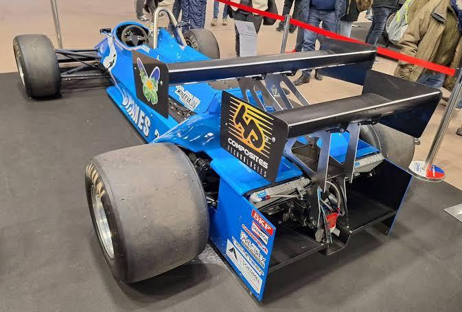

# Portfolio — Nicolas Cabaset

**Élève-ingénieur ESTACA · CFD & aérodynamique**

 

&nbsp;&nbsp;&nbsp;&nbsp;
&nbsp;&nbsp;&nbsp;&nbsp;

  

  

---

## 📑 Sommaire

**1) [Projet CFD LiU](#1-projet-cfd-liu--étude-cfd-sur-modèle-drivaer-avec-hpc) (en cours)** — *Outils : Ansys Fluent Standalone / ANSA / ParaView / HPC (Linux) / Python*
- [Nettoyage CAO](#-nettoyage-cao-ansa)
- [Mesh surfacique et préparation volumique](#-mesh-surfacique-et-préparation-volumique)
- [Mesh volumique](#-mesh-volumique-en-cours)
- [Automatisation](#%EF%B8%8F-automatisation-en-cours)
- [Suite du projet](#%EF%B8%8F-suite-du-projet)

**2) [Ayari Racing × ESTACA : Étude CFD Ligier JS21](#2-ayari-racing--estaca--étude-cfd-ligier-js21-pour-monaco)** — *Outils : Ansys Workbench (Fluent / Meshing) / SolidWorks / Python / Excel*
- [A) Optimisation aileron avant](#a-optimisation-aileron-avant)
- [B) Optimisation aileron arrière](#b-optimisation-aileron-arrière)

**3) [Amélioration de la soufflerie de HAN](#3-projets-à-han--amélioration-de-la-soufflerie-de-han)** — *Outils : SolidWorks Flow Simulation / SolidWorks CAO / Excel / Cura (impression 3D)*
- [A) Étude de faisabilité de l'intégration CFD complète du ventilateur](#a-étude-de-faisabilité-de-lintégration-cfd-complète-du-ventilateur)
- [B) Conception et intégration d'un profil aéro pour l'injection de fumée en soufflerie](#b-conception-et-intégration-dun-profil-aéro-pour-linjection-de-fumée-en-soufflerie)

---

## 1) Projet CFD LiU — Étude CFD sur modèle DrivAer avec HPC

<table>
<tr>
<td width="45%" align="center"></td>
<td>

| | |
|---|---|
| **Date** | 01/09/2026 → maintenant 🟡 *en cours* |
| **Contexte** | Semestre d'échange (Linköping University) — projet du cours *Applied CFD* |
| **Rôle** | Co-responsable CFD et *CAD cleaning* |
| **Outils** | Ansys Fluent Standalone · ANSA · ParaView · HPC (Linux) · Python |

</td>
</tr>
</table>

> **🎯 Problématique et objectif :** partir d'un modèle de géométrie sale pour en faire une CFD sur un HPC et automatiser/généraliser son workflow.

### 🧹 Nettoyage CAO (ANSA)

**Actions**
- **Correction topologique** — élimination des surfaces sécantes et fermeture étanche de l'ensemble des trous de la géométrie.
- **Simplification géométrique** — lissage des zones complexes (ex. calandre) et suppression des appendices secondaires (ex. rétroviseurs) pour alléger la charge de calcul.
- **Traitement du contact au sol** — création de surfaces de contact sous les pneumatiques pour une transition propre entre la route et les roues.

**Livrable** — modèle CAO finalisé : géométrie propre, fermée et optimisée, prête à être importée dans le mailleur.

<table>
<tr>
<td align="center" width="50%"> Surface de contact pneu/sol pour assurer un bon maillage</td>
<td align="center" width="50%"> Exemple de simplification : calandre simplifiée et fermée</td>
</tr>
</table>

### 🔺 Mesh surfacique et préparation volumique

**Actions**
- **Maillage carrosserie** — maillage surfacique basé sur la courbure (fonction *curvature*) avec bornes min/max strictes des cellules.
- **Raffinement sur les roues** — ciblage de courbure avec taille maximale réduite et *growth rate* imposé.
- **Contrôle de qualité** — détection et amélioration ciblée des cellules de skewness > 0,95.
- **Zones d'influence** — trois volumes de raffinement emboîtés (BOI – *Bodies Of Influence*) pour guider le maillage volumique.

**Livrables**
- **Maillage surfacique validé** respectant des critères de qualité stricts.
- **Architecture de raffinement** : BOI prêts à contraindre la croissance du maillage 3D dans le sillage.

<table>
<tr>
<td align="center" width="50%"> Mesh surfacique avec représentation des BOI (bleu)</td>
<td align="center" width="50%"> Domaine avec le mesh et les BOI (bleu)</td>
</tr>
</table>

### 🧊 Mesh volumique *(en cours)*

**Actions**
- **Couches limites (prism layers)** — configuration différenciée des couches d'inflation selon les surfaces physiques.
- **Ciblage y+** — méthode *last ratio* sur la carrosserie et les roues pour un y+ constant et maîtrisé.
- **Transition au sol** — méthode *aspect ratio* sur la piste pour lisser la transition vers le flux libre.
- **Zones d'influence** — paramétrage des trois volumes de raffinement.

**À faire**
- [ ] Valider le mesh volumique (critère ICEM CFD, aspect ratio…)
- [ ] Script de maillage automatisé, applicable à d'autres géométries

### ⚙️ Automatisation *(en cours)*

Automatisation du workflow grâce à des scripts (maillage, solveur, post-traitement).

 
<i>Ébauche de code « user-friendly » pour automatiser le maillage sous Fluent</i>

### 🗺️ Suite du projet

- [ ] **Paramétrage solveur** : rotation des roues, vitesse de la route, conditions aux limites…
- [ ] **Script solveur** : lancer la simulation uniquement via un script, généralisé à d'autres géométries
- [ ] **Review de la simulation** avec analyse des résidus
- [ ] **Post-processing** avec ParaView

---

## 2) Ayari Racing × ESTACA — Étude CFD Ligier JS21 pour Monaco

<table>
<tr>
<td width="40%" align="center"></td>
<td>

| | |
|---|---|
| **Date** | 15/10/2025 → 30/04/2026 |
| **Contexte** | Partenariat technique d'un an (ESTACA 4A) avec Soheil Ayari pour améliorer les performances aérodynamiques d'une F1 historique engagée au Grand Prix de Monaco |
| **Rôle** | Responsable des études CFD · Référent technique assurant la liaison entre les besoins du pilote et le groupe projet |
| **Outils** | Ansys Workbench (Fluent / Meshing) · SolidWorks · Python · Excel |

</td>
</tr>
</table>

### A) Optimisation aileron avant

> **🎯 Problématique et objectif :** optimiser l'angle d'attaque de l'aileron avant pour le GP de Monaco en fonction de sa hauteur au sol.

#### Étude paramétrique

**Actions**
- **Setup paramétrique de l'angle** — variation de l'angle d'attaque (plages validées via CAO).
- **Setup paramétrique de la hauteur** — variation de la hauteur de l'aileron par rapport au sol (plage discutée avec le pilote).

**Livrable** — plages d'angle et de hauteur possibles pour les différents tests.

 
<i>CAO de l'aileron avant montrant la plage d'angle imposée par le flap</i>

#### Domaine, maillage et conditions aux limites

**Actions**
- **Simulation 2D** — configuration simplifiée de l'aileron isolé pour cibler l'impact de l'incidence.
- **Vitesse** — 30 m/s, fixée selon les besoins piste et pilote ; sol en paroi mobile (*moving wall*).
- **Domaine fluide** — dimensionné selon les recommandations (10c amont, 15c aval, 10c hauteur).
- **Maillage** — maillage quadrangle (3 zones de densité) avec couches limites pour garantir un y+ de 1.

**Livrable** — modèle numérique 2D maillé et paramétré.

<table>
<tr>
<td align="center" width="33%"> Domaine complet : vitesse à l'inlet, pression à l'outlet, domaine large pour éviter toute influence externe</td>
<td align="center" width="33%"> Maillage avec 3 zones d'influence</td>
<td align="center" width="33%"> Couches d'inflation pour un y+ de 1</td>
</tr>
</table>

#### Vérification transitoire (transient vs steady)

**Actions**
- **Modèle** — k-ω SST, imposé par l'incapacité hardware d'utiliser un modèle supérieur.
- **Test en stationnaire** — observation d'oscillations dans le Cl et les résidus.
- **Test en transitoire** — meilleure convergence constatée.
- **Comparaison** — les deux aboutissent au même Cl (unique coefficient utile au vu de la demande pilote).

**Livrable** — validation du maintien des calculs en stationnaire pour des temps de résolution plus rapides (beaucoup de paramètres à tester).

<table>
<tr><th width="40%">Stationnaire</th><th>Transitoire</th></tr>
<tr>
<td align="center">  Résidus (haut, continuité en bleu) et Cl (bas) : oscillations visibles</td>
<td align="center">  Converge davantage : continuité à 1e-3 contre 1e-2 en steady</td>
</tr>
</table>

#### Post-traitement

**Actions**
- **Choix de métrique** — focalisation sur la portance (Cl) pour répondre au besoin d'appui maximal ; uniquement comparatif car Cl 2D.
- **Script Python** — traitement du signal (exclusion du régime transitoire, moyenne sur cycles stabilisés via autocorrélation) pour récupérer le Cl de chaque simulation après le batch de calcul.
- **Comparaison** — croisement des données de portance avec les angles et hauteurs testés.
- **Exploitation** — traduction des résultats en réglages physiques mesurables simplement (mètre ruban).

**Livrables** — courbes ci-dessous et rapport technique vulgarisé à destination du pilote.

<table>
<tr>
<td align="center" width="50%"> Coefficient de portance en fonction de l'angle d'attaque pour différentes hauteurs au sol</td>
<td align="center" width="50%"> Angle de Cl max en fonction de la hauteur au sol : le pilote sait directement quel angle imposer selon la hauteur choisie le jour J</td>
</tr>
</table>

#### Rétrospective

<table>
<tr>
<td width="50%" valign="top">

**Compétences clés développées**
- **Maîtrise logicielle** : prise en main et exploitation d'Ansys Fluent (Workbench).
- **Interface technique/client** : traduction des besoins en solutions techniques et restitution vulgarisée.
- **Optimisation des calculs** : choix des modèles physiques selon les contraintes hardware, ciblage y+.
- **Analyse et synthèse de données** : traitement automatisé via Python d'une campagne de **90 simulations**.

</td>
<td width="50%" valign="top">

**Axes d'amélioration**
- **Validation des solveurs** : étendre la comparaison steady/transient à plusieurs incidences, ou imposer le transitoire.
- **Précision numérique** : CFL, GCI, growth rate, skewness, résidus de continuité ≤ 1e-3.
- **Optimisation du maillage** : grossir le maillage loin de l'aileron.
- **Stabilisation des résultats** : prolonger les calculs transitoires.
- **Diversification des conditions** : balayer plusieurs vitesses d'écoulement.

</td>
</tr>
</table>

### B) Optimisation aileron arrière

> **🎯 Problématique et objectif :** optimiser la géométrie de l'aileron arrière de type Monaco pour le GP.

#### Étude paramétrique

**Actions**
- **Analyse réglementaire** — étude des contraintes imposant des distances d'écartement spécifiques.
- **Analyse des libertés (CAO)** — évaluation des mouvements et débattements permis par les différents éléments.

**Livrable** — tableau de paramétrage des plages géométriques admissibles :

| Paramètre | Plage |
|---|---|
| d1 | > 0 |
| d2 | [0 ; 600 mm] |
| Hauteur aile/sol | 1000 mm max |
| Plage angle flap | [0 ; 20°] |
| Angle d'attaque (α) | libre |

<table>
<tr>
<td align="center" width="50%"> CAO du double aileron arrière, spécifique à la Ligier JS21 de 1983 pour Monaco</td>
<td align="center" width="25%"> Angle flap maxi</td>
<td align="center" width="25%"> Angle flap mini</td>
</tr>
</table>

 
<i>Illustration des distances d1 et d2</i>

#### Domaine, maillage et solveur

**Actions**
- **Configuration du domaine** — reprise de l'environnement 2D de l'aileron avant, ajusté aux nouvelles dimensions.
- **Maillage structuré** — paramètres identiques (zones d'influence, ciblage y+) à l'étude précédente.
- **Paramétrage physique** — même vitesse et modèle k-ω SST en régime stationnaire.

**Livrable** — environnement de simulation 2D complet et standardisé, calqué sur la méthodologie de l'aileron avant.

<table>
<tr>
<td align="center" width="50%"> Maillage avec 3 zones d'influence</td>
<td align="center" width="50%"> Couches d'inflation pour un y+ de 1</td>
</tr>
</table>

#### Post-traitement

**Actions**
- **Traitement automatisé** — réutilisation du script Python développé précédemment.
- **Analyse comparative** — évaluation des **40 configurations** simulées pour cibler l'appui maximal exigé par Monaco.
- **Choix de métrique** — Cl uniquement, à titre comparatif (2D).

**Livrable** — sélection et validation du meilleur réglage aérodynamique pour le pilote.

<table>
<tr>
<td align="center" width="50%"> <b>Configuration de base — Cl = 0,97</b></td>
<td align="center" width="50%"> <b>Meilleure des 40 — Cl = 2,57</b></td>
</tr>
</table>

> On observe une utilisation complète des deux ailerons, contrairement à la configuration de base.

#### Rétrospective

<table>
<tr>
<td width="50%" valign="top">

**Compétences clés développées**
- **Conformité et intégration géométrique** : arbitrage entre réglementation technique et débattements réels autorisés par la CAO.
- **Robustesse paramétrique** : stratégie de maillage unique et fiable, s'adaptant sans erreur à toutes les variations géométriques.

</td>
<td width="50%" valign="top">

**Axes d'amélioration**
- **Interaction globale** : intégrer le reste de la voiture (roues tournantes, sillage).
- **Couplage aérothermique** : prendre en compte le flux thermique du capot moteur.
- **Modélisation 3D** : capturer l'effet de la différence de largeur entre les ailerons.
- **Validation des solveurs** : comparer transitoire et stationnaire.
- **Plan d'expériences (DOE)** : réduire le nombre de simulations.
- **Précision numérique** : CFL, GCI, growth rate…

</td>
</tr>
</table>

---

## 3) Projets à HAN — Amélioration de la soufflerie de HAN

<table>
<tr>
<td width="50%" align="center"></td>
<td>

| | |
|---|---|
| **Date** | 01/02/2025 → 01/06/2025 |
| **Contexte** | Semestre d'échange (HAN University of Applied Sciences) — projet d'ingénierie à quasi plein temps (4 j/semaine) |
| **Rôle** | Responsable simulations CFD |
| **Outils** | SolidWorks Flow Simulation · SolidWorks CAO · Excel · Cura |

</td>
</tr>
</table>

### A) Étude de faisabilité de l'intégration CFD complète du ventilateur

> **🎯 Problématique et objectif :** évaluer la faisabilité d'un couplage CFD complet entre le ventilateur et le reste de la soufflerie afin d'identifier les axes d'amélioration.

#### Mesures de vitesses pour comparaison CFD/mesures

**Action** — définition d'une grille de points de mesure identique en réel et en CFD pour relever les vitesses en sortie de ventilateur au tube de Pitot.

**Livrable** — cartographie comparative des écarts de vitesse pour identifier les erreurs et leur ampleur.

 
<i>Vitesses moyennes réelles sur la grille de mesure (A1 en haut à gauche de la sortie du ventilateur, F5 en bas à droite)</i>

#### Mise au point, stabilisation et comparaison simulation/réalité (SolidWorks)

**Actions**
- **Optimisation du maillage et des paramètres physiques** — raffinements itératifs post-calcul : y+ adéquat, interface rotor/stator, gradients élevés ; rugosité de paroi et modèle de rotation préconisé par le solveur.
- **Troubleshooting des crashs solveur** — diminution progressive de la vitesse de rotation et diagnostic géométrique pour simplifier des micro-détails bloquants.

<table>
<tr>
<td align="center" width="50%"> Raffinement autour des zones de fort gradient et de la limite zone fixe/tournante</td>
<td align="center" width="50%"> Crash solveur après 3 jours de calcul</td>
</tr>
</table>

**Livrables**
- **Modèle stabilisé et étude des limites de calcul** — écarts majeurs entre CFD et mesures, et démonstration de l'impossibilité d'obtenir un modèle corrélé au réel avec les délais et un PC grand public.
- **Bilan méthodologique** — synthèse des verrous numériques et besoins matériels, ayant servi à recadrer la faisabilité pédagogique de ces simulations dans le cours de CFD de l'université.

 
<i>Écart entre résultats CFD et mesures réelles, en %</i>

#### Rétrospective

<table>
<tr>
<td width="50%" valign="top">

**Compétences clés développées**
- Identification des facteurs influençant la précision du calcul
- Compréhension des limitations hardware
- **SolidWorks Flow Simulation** : maillage, configuration du calcul et post-traitement, base pour aborder des solveurs plus avancés

</td>
<td width="50%" valign="top">

**Axes d'amélioration**
- **Ciblage plus rapide des bons paramètres** dès les premières itérations.
- **Transition vers un solveur CFD dédié** : meilleures couches d'inflation, accès à k-ω SST.
- **Étude de sensibilité du dispositif expérimental** : fixation instrumentée vs maintien manuel, position axiale.

</td>
</tr>
</table>

### B) Conception et intégration d'un profil aéro pour l'injection de fumée en soufflerie

> **🎯 Problématique et objectif :** concevoir le profil aérodynamique d'un *smoke rake* pour réduire sa traînée parasite et assurer l'injection d'un flux de fumée non perturbé.

#### Étude comparative, dimensionnement et sélection du profil

**Actions**
- **Présélection théorique et adaptation CAO** — sélection de 4 profils laminaires NACA série 6 symétriques (0 % de cambrure) à plus faible traînée, mis à l'échelle sous SolidWorks pour loger le smoke rake.

 
<i>Exemple de profil retenu : 0 % de cambrure et faible traînée pour le Re de l'écoulement</i>

- **Caractérisation CFD en sillage** — simulations à V∞ = 22,2 m/s et extraction des vitesses sur une grille identique en aval pour comparer la perturbation de chaque profil.

**Livrable** — matrice de vitesses et choix du profil perturbant le moins l'écoulement.

<table>
<tr>
<td align="center" width="50%"> Profil 18 % d'épaisseur</td>
<td align="center" width="50%"> Profil 10 % d'épaisseur ✅</td>
</tr>
</table>

<i>F1 le plus proche du bord de fuite, A6 le plus loin. Choix du profil 10 % : vitesses plus proches de 22,2 m/s.</i>

#### Optimisation aéro des buses d'injection et conception interne pour impression 3D

**Action** — étude paramétrique CFD sur l'implantation des buses (en retrait, affleurantes ou sortantes) et comparaison des profils de vitesse en sillage pour retenir la géométrie offrant le flux le plus régulier.

 
<i>Cut plot comparatif : configuration de buse à perturbation minimale vs configuration défavorable</i>

**Livrable** — pièce imprimée en 3D ajustée sur le peigne, prête pour le lissage de surface avant les essais en soufflerie.

 &nbsp;

#### Rétrospective

<table>
<tr>
<td width="50%" valign="top">

**Compétences clés développées**
- **Dimensionnement aéro & CAO (SolidWorks)** : choisir un profil NACA et l'adapter sous contrainte d'encombrement.
- **Études paramétriques CFD** : comparer des champs de vitesse pour minimiser les perturbations.
- **Conception orientée intégration** : évider un volume intérieur, anticiper les jeux de montage.
- **Impression 3D (Cura)** : arbitrer entre finesse aérodynamique et contraintes d'impression.

</td>
<td width="50%" valign="top">

**Axes d'amélioration**
- **Intégrer l'épaisseur requise en amont** : présélectionner sur la traînée réelle Fx après mise à l'échelle plutôt que sur un Cx catalogue.
- **Élargir les critères CFD** : perte de pression totale et énergie cinétique turbulente (TKE).
- **Validation expérimentale en soufflerie** après lissage pour corréler la CFD.

</td>
</tr>
</table>

---

📄 Portfolio complet : [`Portfolio_Cabaset_Nicolas.pdf`](Portfolio_Cabaset_Nicolas.pdf)

© Nicolas Cabaset

