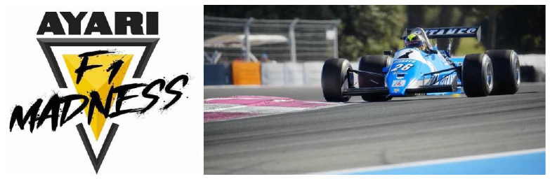
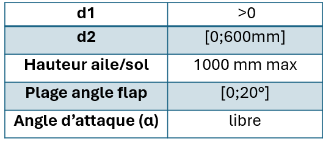

<h1 align="center">Portfolio</h1>

<table align="center">
<tr>
<td align="center" width="50%"></td>
<td align="center" width="50%"></td>
</tr>
<tr>
<td align="center"></td>
<td align="center"></td>
</tr>
</table>

<h3 align="right">Nicolas Cabaset</h3>

 

# Sommaire

<table>
<tr>
<td width="55%" valign="top">

**1) [Projet CFD LiU](#projet-cfd-liu) (En cours)**

- **Nettoyage CAO**
- **Mesh surfacique et préparation volumique**
- **Mesh volumique**
- **Automatisation**
- **Suite du projet**

</td>
<td valign="top">

***Outils :*** *Ansys Fluent Standalone / Ansa / Paraview / HPC (Linux) / Python*

</td>
</tr>
<tr>
<td valign="top">

**2) [Ayari Racing x Estaca : Etude CFD Ligier JS21](#ayari-racing-x-estaca)**

- **A) Optimisation Aileron avant**
- **B) Optimisation Aileron Arrière**

</td>
<td valign="top">

***Outils :*** *Ansys Workbench (Fluent / Meshing) / SolidWorks / Python / Excel*

</td>
</tr>
<tr>
<td valign="top">

**3) [Amélioration de la soufflerie de HAN](#projets-à-han)**

- **A) Etude de faisabilité de l'intégration CFD complète du ventilateur**
- **B) Conception et intégration d'un profil aéro pour l'injection de fumée en soufflerie**

</td>
<td valign="top">

***Outils :*** *SolidWorks FlowSimulation / SolidWorks CAO / Excel / Cura (Impression 3D)*

</td>
</tr>
</table>

 

<!-- ============================ 1) PROJET CFD LIU ============================ -->

# Projet CFD LiU

## <ins>Etude CFD sur modèle DrivAer avec HPC</ins>

<table>
<tr>
<td align="center" width="35%"></td>
<td align="center" width="35%"></td>
<td valign="middle"><b><ins>Date</ins> :</b> <b>01/09/2026 – Maintenant (En cours)</b></td>
</tr>
</table>

| | |
|---|---|
| **Contexte :** | Semestre d'échange (LiU) - Projet inscrit dans le cours 'Applied CFD' (en cours actuellement) |
| **Rôle :** | Co-Responsable CFD et CAD cleaning |
| **Outils :** | Ansys Fluent Standalone / Ansa / Paraview / HPC (Linux) / Python |

 

## <ins>Etude CFD sur modèle DrivAer avec HPC</ins>

**<ins>Problématique et Objectif</ins> :** Partir d'un modèle de géométrie sale pour en faire une CFD sur un HPC et automatiser/généraliser son workflow

<table>
<tr>
<td width="60%" valign="top">

### <ins>Réalisation et approche technique</ins> :

$\color{#E8826A}{\underline{\textsf{Nettoyage CAO (Ansa):}}}$

**Actions :**
- **Correction topologique :** Élimination des surfaces sécantes et fermeture étanche de l'ensemble des trous de la géométrie.
- **Simplification géométrique :** Lissage des zones complexes (ex : calandre) et suppression des appendices secondaires (ex : rétroviseurs) pour alléger la charge de calcul.
- **Traitement du contact au sol :** Création de surfaces de contact sous les pneumatiques pour assurer une transition propre entre la route et les roues.

**Livrables :**
- **Modèle CAO finalisé :** Géométrie propre, fermée et optimisée, prête à être importée dans le mailleur.

</td>
<td valign="top" align="center">
 
Surface de contact pneu/sol pour assurer un bon maillage  
 
Exemple de simplification : Calandre simplifiée et fermée
</td>
</tr>
</table>

 

## <ins>Etude CFD sur modèle DrivAer avec HPC</ins>

**<ins>Problématique et Objectif</ins> :** Partir d'un modèle de géométrie sale pour en faire une CFD sur un HPC et automatiser/généraliser son workflow

<table>
<tr>
<td width="60%" valign="top">

$\color{#E8826A}{\underline{\textsf{Mesh surfacique et préparation volumique:}}}$

**Actions :**
- **Maillage carrosserie :** Génération d'un maillage surfacique basé sur la courbure (fonction *curvature*) avec définition stricte des bornes minimales et maximales des cellules.
- **Raffinement sur les roues :** Application du ciblage de courbure sur les roues avec une taille maximale réduite et imposition d'un *growth rate*
- **Contrôle de qualité :** Détection et amélioration ciblée des cellules critiques de skewness supérieure à 0,95.
- **Définition des zones d'influence :** Création et paramétrage de trois volumes de raffinement emboîtés (BOI - Bodies Of Influence) pour anticiper et guider le maillage volumique

**Livrables :**
- **Maillage surfacique validé :** Enveloppe de la géométrie discrétisée respectant les critères de qualité stricts.
- **Architecture de raffinement :** Volumes de contrôle (BOI) prêts à contraindre la croissance du maillage 3D dans le sillage.

</td>
<td valign="top" align="center">
 
<i>Image du mesh surfacique avec la représentation des BOI (bleu)</i>  
 
<i>Image du domaine avec le mesh et les BOI (bleu)</i>
</td>
</tr>
</table>

 

## <ins>Etude CFD sur modèle DrivAer avec HPC</ins>

**<ins>Problématique et Objectif</ins> :** Partir d'un modèle de géométrie sale pour en faire une CFD sur un HPC et automatiser/généraliser son workflow

$\color{#E8826A}{\underline{\textsf{Mesh volumique:}}}$ &nbsp;&nbsp;&nbsp;&nbsp;&nbsp;&nbsp;&nbsp;&nbsp; **(En cours)**

**Actions :**
- **Génération des couches limites (Prism Layers) :** Configuration différenciée des couches d'inflation selon les surfaces physiques.
- **Ciblage y+ :** Utilisation de la méthode *last ratio* sur la carrosserie et les roues pour garantir un y+ constant et maîtrisé autour du véhicule.
- **Transition au sol :** Application de la méthode *aspect ratio* sur la surface de la piste pour lisser la transition volumétrique vers le flux libre et éviter les sauts brusques de taille de mailles.
- **Définition des zones d'influence :** Paramétrage de trois volumes de raffinement

**A faire :**
- **Valider le mesh volumique :** Vérifier le critère ICEMCFD, aspect ratio etc
- **Script du maillage :** script pour automatiser la génération du maillage et qu'il soit accessible à d'autres géométries que la nôtre

 

## <ins>Etude CFD sur modèle DrivAer avec HPC</ins>

**<ins>Problématique et Objectif</ins> :** Partir d'un modèle de géométrie sale pour en faire une CFD sur un HPC et automatiser/généraliser son workflow

<table>
<tr>
<td width="35%" valign="top">

$\color{#E8826A}{\underline{\textsf{Automatisation (en cours)}}}$

**Automatisation du Workflow grâce à des scripts (maillage, solver, post traitement)**

   

<i>Ebauche de code user-friendly pour automatiser le maillage sous Fluent</i>

</td>
<td align="center"></td>
</tr>
</table>

 

## <ins>Etude CFD sur modèle DrivAer avec HPC</ins>

**<ins>Problématique et Objectif</ins> :** Partir d'un modèle de géométrie sale pour en faire une CFD sur un HPC et automatiser/généraliser son workflow

$\color{#E8826A}{\underline{\textsf{Suite du projet:}}}$

- **Paramétrage solver :** rotation des roues, vitesse de la route, conditions aux limites etc.
- **Script solver : permettre de lancer la simulation uniquement via un script, qui doit être généralisé pour être applicable à d'autres géométries.**
- **Review de la simulation avec analyse des résidus**
- **Post-processing avec Paraview**

 

<!-- ============================ 2) AYARI RACING X ESTACA ============================ -->

# Ayari Racing x Estaca

## <ins>Etude CFD Ligier JS21 pour Monaco</ins>

<table>
<tr>
<td align="center" width="22%"></td>
<td align="center" width="30%"></td>
<td align="center" width="30%"> </td>
<td valign="middle"><b><ins>Date</ins> :</b> <b>15/10/2025 – 30/04/2026</b></td>
</tr>
</table>

| | |
|---|---|
| **Contexte :** | Partenariat technique d'un an (ESTACA 4A) avec Soheil Ayari pour l'amélioration des performances aérodynamiques d'une F1 historique engagée au Grand Prix de Monaco |
| **Rôle :** | - Responsable des études CFD - Référent technique assurant la liaison directe entre les besoins du pilote (Soheil Ayari) et le groupe projet. |
| **Outils :** | Ansys Workbench (Fluent / Meshing) / SolidWorks / Python / Excel |

 

## <ins>Etude CFD Ligier JS21 pour Monaco</ins>

### A) Optimisation aileron avant

**<ins>Problématique et Objectif</ins> :** Optimiser l'angle d'attaque de l'aileron avant pour le GP de Monaco en fonction de sa hauteur au sol

### <ins>Réalisation et approche technique</ins> :

$\color{#0E8C94}{\underline{\textsf{Étude paramétrique :}}}$

**Actions :**
- **Setup paramétrique de l'angle :** Variation de l'angle d'attaque (plages validées via CAO)
- **Setup paramétrique de la hauteur :** Variation de la hauteur de l'aileron par rapport au sol (plage discutée avec le pilote)

<table>
<tr>
<td width="45%" valign="top">

**Livrables :**
- **Plage d'angle et de hauteur** possible pour les différents tests

</td>
<td align="center"></td>
<td width="20%"><i>CAO de l'aileron avant montrant la plage d'angle imposée par le flap</i></td>
</tr>
</table>

 

## <ins>Etude CFD Ligier JS21 pour Monaco</ins>

### A) Optimisation aileron avant

### <ins>Réalisation et approche technique</ins> :

$\color{#0E8C94}{\underline{\textsf{Domaine, Maillage et Conditions aux limites :}}}$

**Actions :**
- **Simulation 2D :** configuration simplifiée de l'aileron isolé pour cibler l'impact de l'incidence.
- **Vitesse :** Application d'une vitesse de 30 m/s fixée par rapport aux besoins piste et pilote et configuration du sol en paroi mobile (moving wall).
- **Dimensionnement du domaine fluide :** selon les recommandations (10c amont, 15c aval, 10c hauteur).
- **Maillage :** maillage carré (3 zones de densité) avec couches limites pour garantir un y+ de 1.

**Livrables :**
- **Modèle numérique 2D maillé et paramétré**

<table>
<tr>
<td align="center" width="50%"> <i>Domaine complet avec boundary condition de vitesse à l'inlet, de pression à l'outlet, et grande taille de domaine pour ne pas avoir d'influence externe</i></td>
<td align="center" width="50%"> <i>Maillage avec 3 zones d'influences</i>   <i>Couches d'inflation pour avoir un y+ de 1</i></td>
</tr>
</table>

 

## <ins>Etude CFD Ligier JS21 pour Monaco</ins>

<table>
<tr>
<td width="40%" valign="top">

### A) Optimisation aileron avant

### <ins>Réalisation et approche technique</ins> :

$\color{#0E8C94}{\underline{\textsf{Vérification transitoire (Transient vs Steady):}}}$

**Actions :**
- **Modèle :** Utilisation du modèle K-omega SST, imposé par l'incapacité hardware d'utiliser un modèle supérieur.
- **Test en stationnaire :** observation d'oscillations dans le Cl et les résidus.
- **Test en transitoire :** pour vérifier le comportement : constat d'une meilleure convergence.
- **Comparaison :** aboutissent au même résultat de Cl (unique coef utile ici au vu de la demande pilote)

**Livrables :**
- Validation du maintien des calculs en stationnaire (steady) pour garantir des temps de résolution plus rapides (beaucoup de paramètres à tester)

</td>
<td width="25%" valign="top" align="center">
<b>Stationnaire</b> 
 
<i>Graphique des résidus (haut, continuité en bleu) et du Cl (bas) en fonction du nombre d'itérations. On observe les oscillations</i> 

</td>
<td valign="top" align="center">
<b>Transitoire</b> 
 
<i>Graphique des résidus (haut, continuité en bleu) et du Cl (bas) en fonction du nombre d'itérations. Plus d'oscillations et converge plus (1e-3 pour la continuité, contre 1e-2 en steady)</i> 

</td>
</tr>
</table>

 

## <ins>Etude CFD Ligier JS21 pour Monaco</ins>

<table>
<tr>
<td width="40%" valign="top">

### A) Optimisation aileron avant

### <ins>Réalisation et approche technique</ins> :

$\color{#0E8C94}{\underline{\textsf{Post-traitement:}}}$

**Actions :**
- **Choix de métrique :** Focalisation exclusive sur la portance (Cl) pour répondre au besoin d'appui maximal du pilote. Uniquement à titre comparatif car Cl 2D
- **Script Python :** Création d'un script de traitement du signal (exclusion du régime transitoire, moyenne sur cycles stabilisés via autocorrélation) pour récupérer le Cl de chaque simulation après le batch de calcul
- **Comparaison :** Croisement des données de portance avec les angles et hauteurs testés.
- **Exploitation des données :** Traduction des résultats en réglages physiques mesurables simplement (mètre ruban).

**Livrables :**
- **Différentes courbes présentées ci-contre**
- **Rapport technique vulgarisé à destination du pilote**

</td>
<td width="30%" valign="top" align="center">
 
<i>Coefficient de portance en fonction de l'angle d'attaque de l'aileron avant pour différentes hauteurs au sol.</i>
</td>
<td valign="top" align="center">
 
<i>Angles avec les Cl max en fonction de la hauteur par rapport au sol.  Cette courbe permet directement au pilote de savoir quel angle imposer à son aileron en fonction de la hauteur au sol qu'il souhaite (hauteur pouvant être amenée à changer en fonction des besoins du pilote le jour j)</i>
</td>
</tr>
</table>

 

## <ins>Etude CFD Ligier JS21 pour Monaco</ins>

### A) Optimisation aileron avant

### <ins>Rétrospective</ins> :

<ins>Compétences clés développées</ins> :
- **Maîtrise logicielle :** Prise en main et exploitation d'Ansys Fluent (Workbench).
- **Interface technique/client :** Traduction des besoins en solutions techniques et restitution vulgarisée des résultats.
- **Optimisation des calculs :** Sélection des modèles physiques selon les contraintes hardware et paramétrage de précision (ciblage y+).
- **Analyse et synthèse de données :** Traitement automatisé via Python et traduction simplifiée d'un volume important de résultats (campagne de 90 simulations).

<ins>Axes d'amélioration</ins> :
- **Validation des solveurs :** Étendre la comparaison stationnaire/transitoire sur différentes incidences pour valider la stabilité du modèle, ou imposer le transitoire par défaut.
- **Précision numérique :** Intégrer des critères de maillage et de résolution plus poussés : CFL, GCI, growth rate, skewness et résidus de continuité abaissés à au moins 1e-3 (était à 1e-2 sur le stationnaire).
- **Optimisation du maillage :** Alléger le coût de calcul en grossissant le maillage dans les zones très éloignées de l'aileron.
- **Stabilisation des résultats :** Prolonger les calculs transitoires pour garantir une stabilisation complète et définitive de la portance.
- **Diversification des conditions :** Balayer plusieurs vitesses d'écoulement pour enrichir le modèle.

 

## <ins>Etude CFD Ligier JS21 pour Monaco</ins>

### B) Optimisation aileron arrière

**<ins>Problématique et Objectif</ins> :** Optimiser la géométrie de l'aileron arrière de type Monaco pour le GP

<table>
<tr>
<td width="35%" valign="top">

### <ins>Réalisation et approche technique</ins> :

$\color{#7030A0}{\underline{\textsf{Étude paramétrique :}}}$

**Actions :**
- **Analyse réglementaire :** Étude des contraintes imposant des distances d'écartement spécifiques.
- **Analyse des libertés (CAO) :** Évaluation géométrique des mouvements et débattements permis par les différents éléments physiques.

**Livrables :**
- **Tableau de paramétrage :** Synthèse des plages de variation géométriques admissibles pour la simulation.

</td>
<td valign="top" align="center">
 
<i>CAO du double aileron arrière, spécifique à la Ligier JS21 de 1983 pour le grand prix de Monaco</i>  
 
<i>Tableau représentant les plages géométriques possibles, avec illustration des distances</i>  

</td>
<td width="15%" valign="top" align="center">
<i>Angle flap maxi</i>   
<i>Angle flap mini</i> 
</td>
</tr>
</table>

 

## <ins>Etude CFD Ligier JS21 pour Monaco</ins>

### B) Optimisation aileron arrière

<table>
<tr>
<td width="50%" valign="top">

### <ins>Réalisation et approche technique</ins> :

$\color{#7030A0}{\underline{\textsf{Domaine, maillage et solveur :}}}$

**Actions :**
- **Configuration du domaine :** Reprise de l'environnement 2D de l'aileron avant, ajusté aux nouvelles dimensions.
- **Maillage structuré :** Application de paramètres identiques (zones d'influence, ciblage y+) à la précédente étude.
- **Paramétrage physique :** Maintien de la vitesse de simulation et du modèle k-ω SST en régime stationnaire.

**Livrables :**
- **Modèle numérique 2D :** Environnement de simulation complet et standardisé, calqué sur la méthodologie de l'aileron avant.

</td>
<td valign="top" align="center">
 
<i>Maillage avec 3 zones d'influences</i>  
 
<i>Couches d'inflation pour avoir un y+ de 1</i>
</td>
</tr>
</table>

 

## <ins>Etude CFD Ligier JS21 pour Monaco</ins>

### B) Optimisation aileron arrière

<table>
<tr>
<td width="45%" valign="top">

### <ins>Réalisation et approche technique</ins> :

$\color{#7030A0}{\underline{\textsf{Post-traitement:}}}$

**Actions :**
- **Traitement automatisé : Réutilisation du script Python développé précédemment pour extraire les résultats.**
- **Analyse comparative :** Évaluation des 40 configurations simulées pour cibler l'appui maximal (Cl) exigé par le tracé de Monaco.
- **Choix de métrique :** Focalisation exclusive sur la portance (Cl) pour répondre au besoin d'appui maximal du pilote. Uniquement à titre comparatif car Cl 2D

**Livrables :**
- **Configuration optimale :** Sélection et validation du meilleur réglage aérodynamique final pour le pilote.

</td>
<td width="35%" valign="top" align="center">
  

</td>
<td valign="top">
<i>Velocity contour de la configuration de base (Cl=0,97)</i>
      
<i>Velocity contour de la configuration avec le meilleur Cl des 40 (Cl=2,57)  On observe une utilisation complète des deux ailerons contrairement à la configuration de base</i>
</td>
</tr>
</table>

 

## <ins>Etude CFD Ligier JS21 pour Monaco</ins>

### B) Optimisation aileron arrière

### <ins>Rétrospective</ins> :

<ins>Compétences clés développées</ins> :
- **Conformité et intégration géométrique :** Arbitrage entre les contraintes strictes de la réglementation technique et les débattements physiques réels autorisés par la CAO.
- **Robustesse paramétrique :** Gestion d'un grand volume de configurations via l'élaboration d'une stratégie de maillage unique et fiable, capable de s'adapter sans erreur à toutes les variations géométriques testées.

<ins>Axes d'amélioration</ins> :
- **Interaction globale :** Intégrer l'impact du reste de la voiture (roues tournantes, sillage), actuellement omis par limitation hardware.
- **Couplage aérothermique :** Prendre en compte le flux thermique du capot moteur environnant, qui influence drastiquement l'aérodynamique du double aileron.
- **Modélisation 3D :** Passer sur un modèle 3D pour capturer l'influence de la différence de largeur entre les ailerons, invisible en 2D
- **Validation des solveurs :** Effectuer une comparaison des calculs en régime transitoire et stationnaire.
- **Plan d'expériences (DOE) :** Implémenter un DOE pour optimiser la recherche de performance tout en réduisant le nombre de simulations.
- **Précision numérique :** Intégrer des critères de qualité de maillage et de calcul plus stricts (CFL, GCI, growth rate…).

 

<!-- ============================ 3) PROJETS A HAN ============================ -->

# Projets à HAN

## <ins>Amélioration de la soufflerie de HAN</ins>

<table>
<tr>
<td align="center" width="25%"></td>
<td align="center" width="50%"></td>
<td valign="middle"><b><ins>Date</ins> :</b> <b>01/02/2025 – 01/06/2025</b></td>
</tr>
</table>

| | |
|---|---|
| **Contexte :** | Semestre d'échange (HAN) – Projet d'ingénierie à quasi plein temps (4 j/semaine) |
| **Rôle :** | Responsable simulations CFD |
| **Outils :** | SolidWorks FlowSimulation / SolidWorks CAO / Excel / Cura (Impression 3D) |

 

# Amélioration de la soufflerie de HAN

### A) Optimisation de la soufflerie : étude de faisabilité de l'intégration CFD complète du ventilateur

**<ins>Problématique et Objectif</ins> :** Évaluer la faisabilité d'un couplage CFD complet entre le ventilateur et le reste de la soufflerie afin d'identifier les axes d'amélioration

<table>
<tr>
<td width="55%" valign="top">

### <ins>Réalisation et approche technique</ins> :

\- $\color{#FF0000}{\underline{\textsf{Mesures de vitesses pour comparaison CFD/mesures:}}}$

**Action :** Définition d'une grille de points de mesure identique en réel et en CFD pour relever les vitesses d'écoulement en sortie de ventilateur à l'aide d'un tube de Pitot

**Livrable :** Cartographie comparative des écarts de vitesse pour identifier les erreurs et leur ampleur

</td>
<td valign="bottom" align="center">
 
<i>Tableau des vitesses moyennes réelles sur la grille de mesure (A1 est le point de mesure en haut à gauche de la sortie du ventilateur, F5 en bas à droite)</i>
</td>
</tr>
</table>

 

# Amélioration de la soufflerie de HAN

### A) Optimisation de la soufflerie : étude de faisabilité de l'intégration CFD complète du ventilateur

### <ins>Réalisation et approche technique</ins> :

\- $\color{#FF0000}{\underline{\textsf{Mise au point, stabilisation et comparaison simulation/réalité pour la CFD du ventilateur (SolidWorks) :}}}$

**Actions :**
- **Optimisation du maillage et des paramètres physiques :** Raffinements itératifs post-calculs (face aux écarts constatés) : Maillage ciblé (y+ adéquat, interface rotor/stator, gradients élevés…), rugosité de paroi et adaptation du modèle de rotation préconisé par le solveur
- **Trouble shooting de crash solver :** Résolution des crashs du solveur en diminuant progressivement la vitesse de rotation et diagnostic géométrique ayant permis d'identifier et simplifier des micro-détails bloquants

<table>
<tr>
<td align="center" width="45%"> <i>Exemple de raffinement du maillage autour des zones de fort gradient et de limite entre zone fixe et tournante</i></td>
<td align="center"> <i>Exemple de crash solver après 3 jours de calculs</i></td>
</tr>
</table>

 

# Amélioration de la soufflerie de HAN

### A) Optimisation de la soufflerie : étude de faisabilité de l'intégration CFD complète du ventilateur

### <ins>Réalisation et approche technique</ins> :

\- $\color{#FF0000}{\underline{\textsf{Mise au point, stabilisation et comparaison simulation/réalité pour la CFD du ventilateur (SolidWorks) :}}}$

**Livrable :**
- **Modèle stabilisé et étude des limites de calcul :** Mise en évidence d'écarts majeurs entre CFD et mesures réelles avec la démonstration de l'impossibilité d'obtenir un modèle corrélé au réel avec les contraintes de temps et le matériel disponible (PC grand public), sans moyens de calculs avancés
- **Bilan méthodologique :** Synthèse des verrous numériques et des besoins matériels ayant servi de retour d'expérience pour recadrer la faisabilité pédagogique de ces simulations sur le cours de CFD de l'université

 
<i>Tableau comparatif des résultats CFD avec la réalité en pourcentage (A1 est le point de mesure en haut à gauche de la sortie du ventilateur, F5 en bas à droite)</i>

 

# Amélioration de la soufflerie de HAN

### A) Optimisation de la soufflerie : étude de faisabilité de l'intégration CFD complète du ventilateur

### <ins>Rétrospective</ins> :

<ins>Compétences clés développées</ins> :
- **Identification des facteurs influençant la précision du calcul**
- **Compréhension des limitations hardware**
- **Utilisation du software SolidWorks Flow Simulation :** Réalisation du maillage, configuration du calcul et post-traitement, servant de base technique pour aborder des solveurs plus avancés

<ins>Axes d'amélioration</ins> :
- **Ciblage plus rapide des bons paramètres :** Mailler aux endroits nécessaires, utiliser les paramètres solver adéquats et ce dès les premières itérations pour avoir un grand gain de temps
- **Transition sur un solver CFD dédié :** Améliorer les couches d'inflations, accéder à d'autres modèles de turbulences comme *k-ω SST*
- **Etude de sensibilité du dispositif expérimental :** Quantification de l'impact des conditions de mesure (fixation instrumentée vs maintien manuel, position axiale) pour limiter les perturbations du flux et fiabiliser les relevés de vitesse

 

# Amélioration de la soufflerie de HAN

### B) Conception et intégration d'un profil aéro pour l'injection de fumée en soufflerie

**<ins>Problématique et Objectif</ins> :** Concevoir le profil aérodynamique d'un smoke rake pour réduire sa traînée parasite en soufflerie et assurer l'injection d'un flux de fumée non perturbé.

### <ins>Réalisation et approche technique</ins> :

\- $\color{#E0A800}{\underline{\textsf{Étude comparative, dimensionnement et sélection du profil aérodynamique:}}}$

**Actions :**
- **Présélection théorique et adaptation CAO :** Sélection de 4 profils laminaires NACA série 6 symétriques (0% de cambrure) avec les plus faibles traînées, puis mise à l'échelle sous SolidWorks pour loger le smoke rake.

 
<i>Exemple de profil retenu avec 0% de cambrure et une faible traînée pour le Re de l'écoulement</i>

 

# Amélioration de la soufflerie de HAN

### B) Conception et intégration d'un profil aéro pour l'injection de fumée en soufflerie

### <ins>Réalisation et approche technique</ins> :

\- $\color{#E0A800}{\underline{\textsf{Étude comparative, dimensionnement et sélection du profil aérodynamique:}}}$

**Actions :**
- **Caractérisation CFD en sillage :** Simulations à V∞ = 22,2 m/s et extraction des vitesses sur une grille de mesure spatiale identique en aval pour comparer la perturbation de l'écoulement des profils.

**Livrables :**
- Matrice de vitesses et choix de profil permettant le moins de perturbations sur l'écoulement

<table>
<tr>
<td align="center" width="50%"></td>
<td align="center" width="50%"></td>
</tr>
</table>

<i>Exemple de matrices de vitesses, F1 le plus proche du bord de fuite, A6 le plus loin Choix se porte sur 10% thickness car vitesses plus proches de 22,2 m/s</i>

 

# Amélioration de la soufflerie de HAN

### B) Conception et intégration d'un profil aéro pour l'injection de fumée en soufflerie

### <ins>Réalisation et approche technique</ins> :

\- $\color{#E0A800}{\underline{\textsf{Optimisation aéro des buses d'injection et conception interne pour impression 3D}}}$

**Actions :**
- **Étude paramétrique CFD sur l'implantation des buses :** Simulation de multiples configurations de dépassement (buses en retrait, affleurantes ou sortantes) et analyse comparative des profils de vitesse en sillage pour sélectionner la géométrie garantissant la meilleure régularité de flux.

<table>
<tr>
<td align="center" width="70%"></td>
<td><i>Cut plot comparatif : Configuration de buse à perturbation minimale du flux aval vs configuration défavorable.</i></td>
</tr>
</table>

<table>
<tr>
<td width="50%" valign="top">

**Livrables :**
- Pièce imprimée en 3D ajustée sur le peigne, livrée prête pour l'étape finale de lissage de surface avant les essais d'écoulement en soufflerie

</td>
<td align="center"> </td>
</tr>
</table>

 

# Amélioration de la soufflerie de HAN

### B) Conception et intégration d'un profil aéro pour l'injection de fumée en soufflerie

### <ins>Rétrospective</ins> :

<ins>Compétences clés développées</ins> :
- **Dimensionnement aéro & CAO (SolidWorks) :** Sélectionner un profil théorique adapté (NACA) et ajuster sa géométrie sous contrainte d'encombrement interne.
- **Études paramétriques CFD :** Analyser et comparer des champs de vitesse pour valider une géométrie minimisant les perturbations de flux
- **Conception orientée intégration :** Évider un volume intérieur et anticiper les jeux de montage pour l'assemblage physique.
- **Impression 3D (Cura) :** Maîtriser les paramètres de tranchage 3D et arbitrer entre finesse aérodynamique et contraintes d'impression

<ins>Axes d'amélioration</ins> :
- **Intégration en amont de l'épaisseur requise :** Présélectionner sur la force de traînée réelle Fx après mise à l'échelle pour le gabarit du peigne, plutôt que sur un Cx catalogue faussé par le redimensionnement ultérieur
- **Élargissement des critères CFD :** Intégrer la perte de pression totale et l'énergie cinétique turbulente (TKE) pour caractériser plus finement les perturbations de sillage
- **Validation expérimentale en soufflerie :** Réaliser des essais réels après le lissage pour corréler les données CFD et ajuster la géométrie si nécessaire

